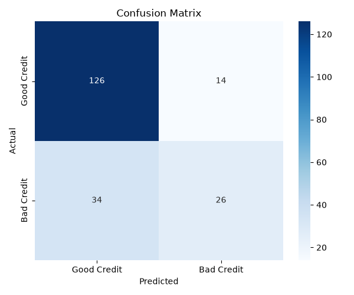
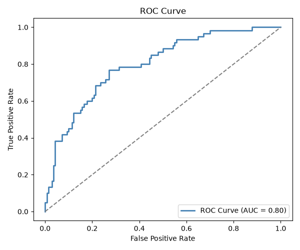
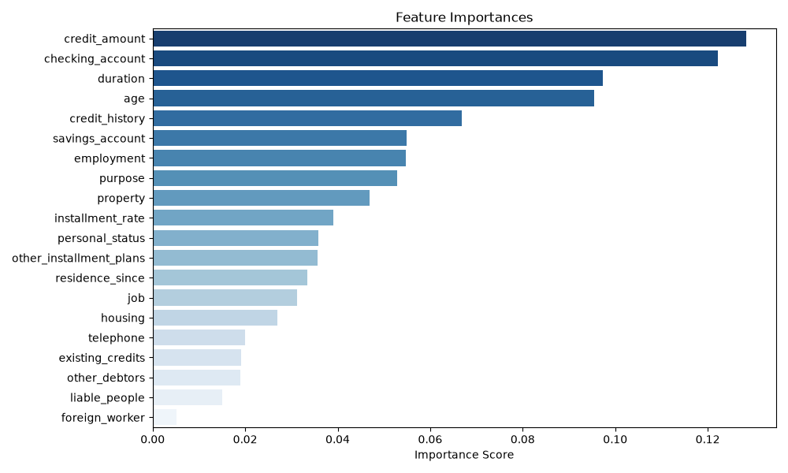

# Credit Risk Classifier

A machine learning project that predicts whether a loan applicant is likely to default, using the German Credit Risk dataset from the UCI Machine Learning Repository.

## Project Structure
credit-risk-classifier/
├── data/
│ ├── raw/ # Original dataset
│ └── processed/ # Cleaned dataset
├── notebooks/ # Jupyter notebooks for EDA
├── outputs/ # Saved charts and model
├── src/
│ ├── data_preprocessing.py
│ ├── model.py
│ └── evaluate.py
├── main.py
└── requirements.txt


## Model Performance
- **Algorithm:** Random Forest Classifier
- **Accuracy:** 76%
- **Dataset:** 1000 applicants, 20 features

## Output Charts

### Confusion Matrix


### ROC Curve


### Feature Importance


## Output Charts
- Confusion Matrix
- ROC Curve (with AUC score)
- Feature Importance Plot

## How to Run

1. Clone the repository:
```bash
   git clone https://github.com/LoloM-19/credit-risk-classifier.git
   cd credit-risk-classifier
```

2. Install dependencies:
```bash
   pip install -r requirements.txt
```

3. Run the pipeline:
```bash
   python main.py
```

## Tech Stack
Python | scikit-learn | pandas | matplotlib | seaborn